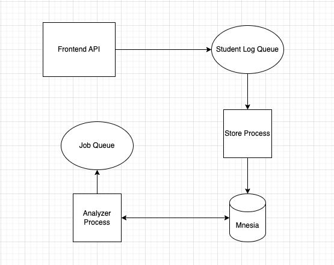

# Db

App processes data from frontend api then push to mnesia database. An main idea of app is cache data to queue that stored in memory then other job get data from the queue and push to db.

## Achitecture



(architect & data flow)

## Dev Guide

The app is run with FeApi app. If you need debug or check data please read FeApi guide.

For run test:
```bash
cd ./apps/db/
mix test
```
