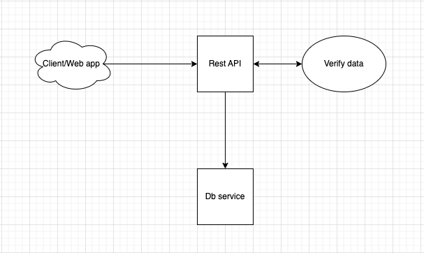

# Frontend Api (FeApi)

A REST API that receives data from client (mobile, web app) verify data then push to queue of Db service.

## Achitecture



(architect & data flow)

## Dev Guide

The app requires Db app, make sure Db is compiled before start app.

For run in dev environment:
```bash
cd ./apps/fe_api
mix phx.server
```

For run test:
```bash
cd ./apps/fe_api
mix test
```

For run Elixir:
```bash
cd ./apps/fe_api
iex -S mix phx.server
```